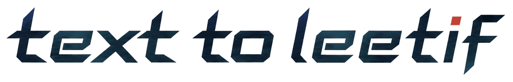

Outil open source qui convertit du texte en Leet Speak (1337) en remplaçant les lettres par leurs équivalents les plus courants tout en conservant le texte lisible.

## Niveaux de Leet Speak

Trois niveaux sont disponibles : plus le niveau est élevé, plus de lettres sont remplacées.

- **Basique** : seulement les chiffres les plus connus (A→4, E→3, I→1, O→0, S→5, T→7).
- **Normal** : ajoute quelques équivalents simples (B→8, C→(, G→6, L→1, R→|2, Z→2).
- **Élevé** : couvre tout l'alphabet avec des caractères simples et lisibles.

| Lettre | 1. Basique | 2. Normal | 3. Élevé |
| ------ | ---------- | --------- | -------- |
| A      | 4          | 4         | 4        |
| B      | B          | 8         | 8        |
| C      | C          | (         | (        |
| D      | D          | D         | \|)      |
| E      | 3          | 3         | 3        |
| F      | F          | F         | \|=      |
| G      | G          | 6         | 6        |
| H      | H          | H         | #        |
| I      | 1          | 1         | 1        |
| J      | J          | J         | \_\|     |
| K      | K          | K         | \|<      |
| L      | L          | 1         | 1        |
| M      | M          | M         | \|\/\|   |
| N      | N          | N         | \|\|     |
| O      | 0          | 0         | 0        |
| P      | P          | P         | \|>      |
| Q      | Q          | Q         | 0\_      |
| R      | R          | \|2       | \|2      |
| S      | 5          | 5         | 5        |
| T      | 7          | 7         | 7        |
| U      | U          | U         | \|\_\|   |
| V      | V          | V         | \/       |
| W      | W          | W         | \/\/     |
| X      | X          | X         | ><       |
| Y      | Y          | Y         | `/       |
| Z      | Z          | 2         | 2        |

Exemples :

- Basique : `Hello World` → `H3ll0 W0rld`
- Normal : `Leet Speak` → `133t 5p3ak`
- Élevé : `Elite Coder` → `3l173 (0d3r`
